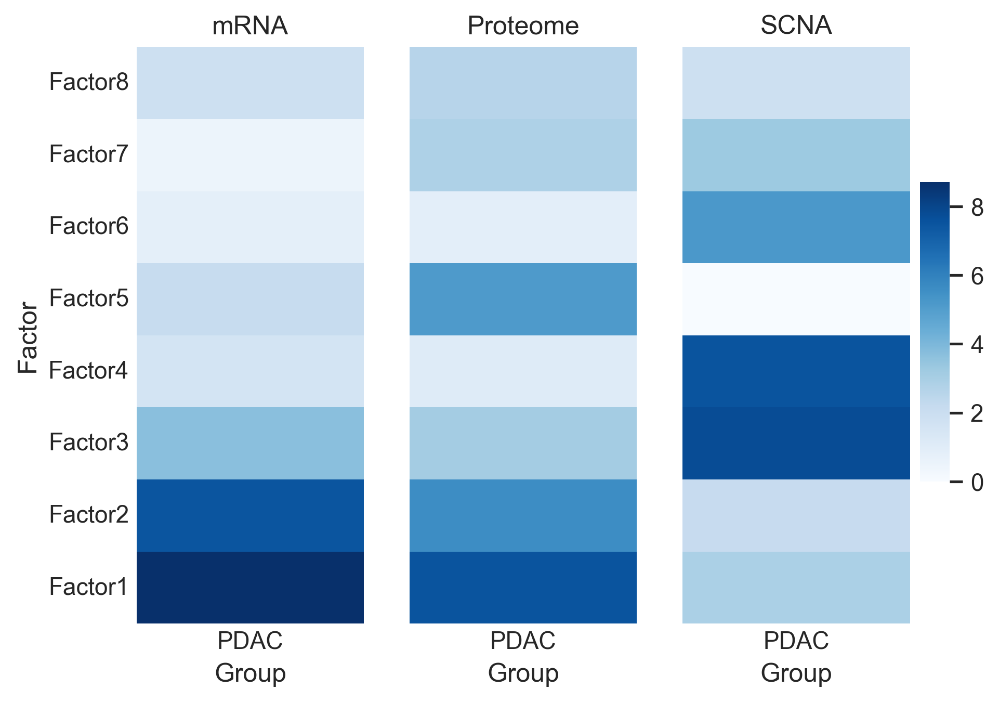
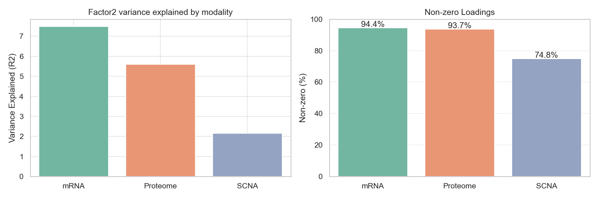
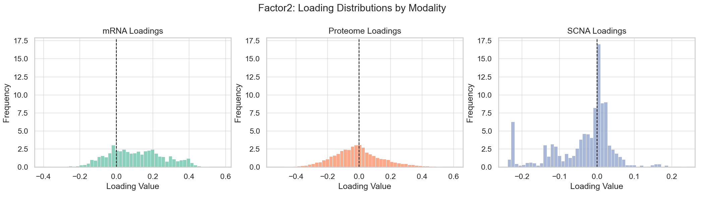
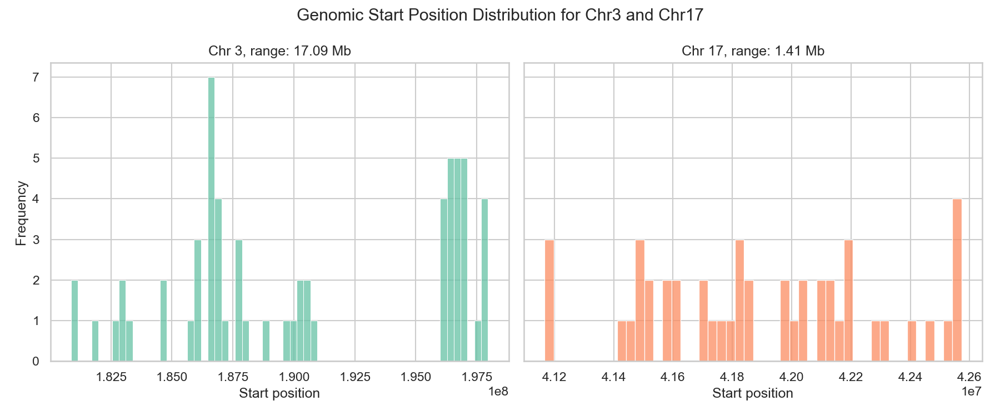
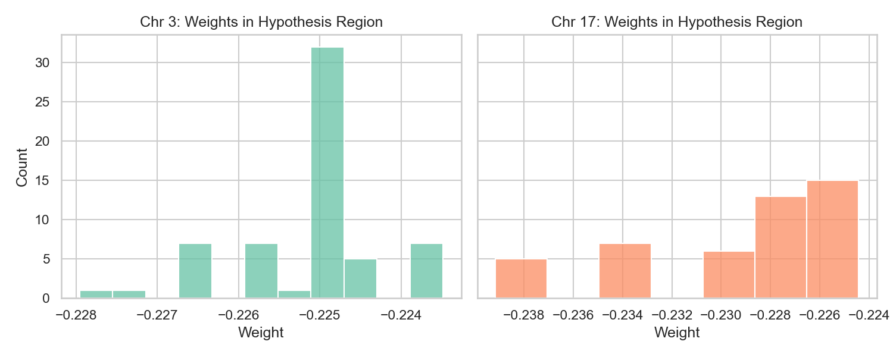
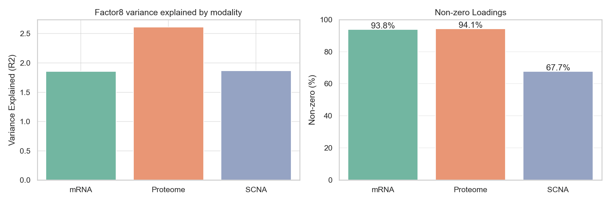
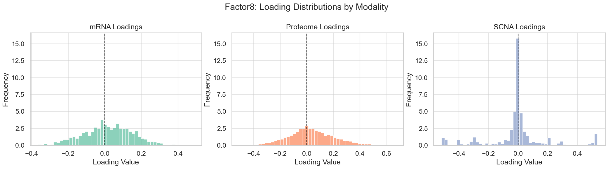

# Exploratory Analysis of Multi-Modal Integration Using MOFA

## Table of Contents
- [Exploratory Analysis of Multi-Modal Integration Using MOFA](#exploratory-analysis-of-multi-modal-integration-using-mofa)
  - [Table of Contents](#table-of-contents)
  - [1. Motivation and Scope](#1-motivation-and-scope)
    - [1.1 Project Motivation and Goal](#11-project-motivation-and-goal)
    - [1.2 Selected Data Modalities](#12-selected-data-modalities)
  - [2. Key Results](#2-key-results)
    - [2.1 MOFA Model Summary](#21-mofa-model-summary)
    - [2.2 Association of Latent Factors with Survival](#22-association-of-latent-factors-with-survival)
      - [2.2.1 Survival Analysis Using MOFA Factors](#221-survival-analysis-using-mofa-factors)
  - [3. Interpretation of Selected Factors](#3-interpretation-of-selected-factors)
    - [3.1 Interpretation of Factor 2](#31-interpretation-of-factor-2)
      - [3.1.1 Modality Contribution and Loading Structure](#311-modality-contribution-and-loading-structure)
      - [3.1.2 Identification of Genomic Regions Associated with SCNA Signal](#312-identification-of-genomic-regions-associated-with-scna-signal)
      - [3.1.3 Functional Characterization of mRNA and Proteome Signals with gProfiler](#313-functional-characterization-of-mrna-and-proteome-signals-with-gprofiler)
    - [3.2 Interpretation of Factor 8](#32-interpretation-of-factor-8)
      - [3.2.1 Modality Contribution and SCNA Structure](#321-modality-contribution-and-scna-structure)
      - [3.2.2 Relationship Between SCNA Regions, Factor 8, and Survival](#322-relationship-between-scna-regions-factor-8-and-survival)
      - [3.2.3 Functional Characterization of mRNA and Proteomic Signals](#323-functional-characterization-of-mrna-and-proteomic-signals)
  - [4. Methods: Data Preprocessing and Model Training](#4-methods-data-preprocessing-and-model-training)
    - [4.1 Clinical Data Preprocessing](#41-clinical-data-preprocessing)
    - [4.2 Omics Data Preprocessing](#42-omics-data-preprocessing)
    - [4.3 MOFA Model Training](#43-mofa-model-training)

## 1. Motivation and Scope

### 1.1 Project Motivation and Goal
The goal of this analysis is to integrate multiple data modalities from a PDAC dataset using MOFA, identify latent factors, and explore whether these factors capture biological signals associated with clinical outcomes. The analysis is purely exploratory and intended for hypothesis generation.

### 1.2 Selected Data Modalities 
The modalities available in the assignment were: clinical data, circRNA, miRNA, mRNA, phosphoproteome, proteome, and SCNA. 

For this analysis, I reduced the number of modalities to allow easier interpretation, selecting clinical data, mRNA, proteome, and SCNA: 
- Clinical data - main source of outcome labels, essential for analysis
- mRNA - gene expression, commonly used in prognostic analyses
- Proteome - protein abundance per gene, captures pathway activation and disease state, provides information about which proteins/signaling pathways are upregulated in high-risk patients  
- SCNA - Somatic Copy Number Alterations per gene, represent genomic structural changes (e.g., oncogene amplification, tumor suppressor deletion), can drive both mRNA and protein changes

Details about data preprocessing are provided in Section 4.

## 2. Key Results

### 2.1 MOFA Model Summary
I used three modalities to train the MOFA model: mRNA, proteome, and SCNA. This approach allows MOFA to learn the underlying biological drivers for each factor, which can then be correlated with survival outcomes from clinical data. The model was initialized with 10 factors and converged to 8 final factors after training. The training code can be found in the `3_train_mofa.ipynb` notebook.

Analysis of the resulting factors was performed using the MOFAx package, following the [official tutorial](https://github.com/bioFAM/mofax/blob/master/notebooks/getting_started_pbmc10k.ipynb):

  
   
  <b>Figure 1.</b> Variance explained per factor and per modality.

Key observations:
  1. Different factors are driven by different modalities, e.g., Factor 1 is primarily driven by mRNA and Factor 3 is primarily driven by SCNA. 
  2. Most factors show variance explained by multiple modalities, indicating that biological signals are shared across data types.

### 2.2 Association of Latent Factors with Survival

#### 2.2.1 Survival Analysis Using MOFA Factors

To identify latent factors potentially relevant to clinical outcome, I calculated the association between each MOFA factor and overall survival using Cox proportional hazards models. Each factor was tested individually using its sample-level factor values.

| Factor   |    HR    |   Coef    |  P-value  |
|----------|----------|-----------|-----------|
| Factor2  | 0.753896 | -0.282500 | 0.002358  |
| Factor8  | 1.529151 |  0.424712 | 0.016868  |
| Factor4  | 1.263506 |  0.233890 | 0.022660  |
| Factor6  | 0.831411 | -0.184631 | 0.208350  |
| Factor3  | 1.021573 |  0.021344 | 0.804748  |
| Factor7  | 1.025310 |  0.024995 | 0.858935  |
| Factor1  | 1.006422 |  0.006402 | 0.915671  |
| Factor5  | 1.006285 |  0.006265 | 0.957607  |

<b>Table 1.</b> Association between MOFA factors and survival.

Factors 2, 8, and 4 show nominally significant associations with survival (p < 0.05).
Factor 2 is associated with improved survival (negative coefficient), while Factors 8 and 4 are associated with worse prognosis (positive coefficients). 
Factors 2 and 8 were selected for downstream interpretation, as they show opposite associations with survival and likely represent contrasting biological states. 

## 3. Interpretation of Selected Factors

### 3.1 Interpretation of Factor 2 

#### 3.1.1 Modality Contribution and Loading Structure

Factor 2 variance is primarily explained by the mRNA modality, which also has the largest number of non-zero feature loadings (Figure 2). Proteomic loadings are more symmetrically distributed around zero, while SCNA loadings are sparse but display a pronounced negative peak (Figure 3).

This suggests that Factor 2 captures transcriptional variation, with some genomic alterations reflected in the SCNA modality.

  
   
  <b>Figure 2.</b> Variance explained per modality and number of non-zero loadings for Factor 2.

  
   
  <b>Figure 3.</b> Distribution of feature loadings for Factor 2 across modalities.

#### 3.1.2 Identification of Genomic Regions Associated with SCNA Signal

To investigate whether the negative SCNA loading peak corresponds to localized genomic events, I examined the genomic positions of genes within the lowest 5% of SCNA loadings using the `mygene` annotation package.

| Chromosome | Gene count |
|------------|------------------|
| 3          | 61               |
| 17         | 46               |

<b>Table 2.</b> Chromosomal distribution of genes with lowest SCNA loadings.

These genes are highly concentrated within relatively small genomic regions on chromosomes 3 and 17, spanning 17 Mb and 1.41 Mb respectively (Figure 4), suggesting the presence of recurrent copy number alterations.

  
   
  <b>Figure 4.</b> Genomic start position distributions of negatively weighted SCNA genes on chromosomes 3 and 17.

To further assess the relationship between the identified SCNA regions and Factor 2, I computed pairwise Spearman correlations between mean SCNA values in the chromosome 3 and chromosome 17 regions, Factor 2 values, and survival time (Table 3).

| Correlation Pair                        | Spearman r | p-value    |
|-----------------------------------------|------------|------------|
| Chr3 mean vs Chr17 mean                | 0.3230     | 0.0002007  |
| Chr3 mean vs survival time             | -0.0679    | 0.4463     |
| Chr17 mean vs survival time            | -0.1810    | 0.04086    |
| Factor 2 vs Chr3 mean                  | -0.2304    | 0.008877   |
| Factor 2 vs Chr17 mean                 | -0.2960    | 0.000693   |

<b>Table 3.</b> Spearman correlations between regional SCNA values, Factor 2, and survival time.

Mean SCNA values in the chromosome 3 and chromosome 17 regions are correlated with each other. Importantly, Factor 2 shows significant negative correlations with SCNA means in both regions, indicating that this latent factor captures variation in these genomic alterations. While only chromosome 17 shows a direct association with survival time, Factor 2 is strongly correlated with both regions. This suggests that the factor integrates multiple coordinated SCNA signals.

#### 3.1.3 Functional Characterization of mRNA and Proteome Signals with gProfiler 
Inspection of MOFA weights within the identified chromosomal regions shows negative loadings for chromosome 17 (Figure 5), consistent with the direction of association observed in the survival analysis.

  
   
  <b>Figure 5.</b> Distribution of MOFA weights within the chromosome 3 and 17 regions.

To functionally characterize this signal, I performed pathway enrichment analysis using g:Profiler on the 100 most negatively weighted mRNA features associated with Factor 2.

The enriched pathways are predominantly related to cytokine signaling, inflammatory response, and immune cell migration (Table 4), suggesting that lower expression of inflammatory and immune-related genes is associated with improved survival.

<table>
  <tr>
    <th>Source</th>
    <th>Name</th>
    <th>p-value</th>
    <th>Intersection Size</th>
  </tr>
  <tr>
    <td>GO:BP</td>
    <td>cytokine-mediated signaling pathway</td>
    <td>0.000128</td>
    <td>16</td>
  </tr>
  <tr>
    <td>KEGG</td>
    <td>Cytokine-cytokine receptor interaction</td>
    <td>0.000237</td>
    <td>14</td>
  </tr>
  <tr>
    <td>KEGG</td>
    <td>Viral protein interaction with cytokine and cytokine receptor</td>
    <td>0.003449</td>
    <td>10</td>
  </tr>
  <tr>
    <td>GO:BP</td>
    <td>cellular response to cytokine stimulus</td>
    <td>0.008103</td>
    <td>16</td>
  </tr>
  <tr>
    <td>GO:BP</td>
    <td>granulocyte chemotaxis</td>
    <td>0.010858</td>
    <td>10</td>
  </tr>
  <tr>
    <td>GO:BP</td>
    <td>inflammatory response</td>
    <td>0.015952</td>
    <td>18</td>
  </tr>
  <tr>
    <td>GO:BP</td>
    <td>leukocyte chemotaxis</td>
    <td>0.024014</td>
    <td>11</td>
  </tr>
  <tr>
    <td>GO:BP</td>
    <td>myeloid leukocyte migration</td>
    <td>0.024014</td>
    <td>11</td>
  </tr>
  <tr>
    <td>GO:BP</td>
    <td>response to cytokine</td>
    <td>0.028645</td>
    <td>16</td>
  </tr>
  <tr>
    <td>GO:BP</td>
    <td>response to peptide</td>
    <td>0.045664</td>
    <td>16</td>
  </tr>
  <tr>
    <td>GO:BP</td>
    <td>granulocyte migration</td>
    <td>0.046819</td>
    <td>10</td>
  </tr>
</table>

 
<b>Table 4.</b> Significantly enriched pathways for negatively weighted mRNA features in Factor 2.

A similar analysis of the 50 most negatively weighted proteomic features revealed enrichment for DNA replication, cell cycle regulation, and DNA damage response pathways (Table 5).

<table>
  <thead>
    <tr>
      <th>Source</th>
      <th>Name</th>
      <th>p-value</th>
      <th>Intersection Size</th>
    </tr>
  </thead>
  <tbody>
    <tr><td>GO:BP</td><td>double-strand break repair via break-induced replication</td><td>9.823730e-07</td><td>5</td></tr>
    <tr><td>REAC</td><td>Unwinding of DNA</td><td>9.096544e-06</td><td>5</td></tr>
    <tr><td>KEGG</td><td>DNA replication</td><td>4.744610e-05</td><td>5</td></tr>
    <tr><td>GO:BP</td><td>regulation of DNA-templated DNA replication initiation</td><td>1.266312e-04</td><td>5</td></tr>
    <tr><td>GO:BP</td><td>DNA replication initiation</td><td>1.656172e-04</td><td>6</td></tr>
    <tr><td>GO:BP</td><td>defense response to fungus</td><td>2.688609e-04</td><td>6</td></tr>
    <tr><td>GO:BP</td><td>response to fungus</td><td>1.346474e-03</td><td>6</td></tr>
    <tr><td>REAC</td><td>Activation of the pre-replicative complex</td><td>4.047180e-03</td><td>5</td></tr>
    <tr><td>REAC</td><td>Activation of ATR in response to replication stress</td><td>8.069051e-03</td><td>5</td></tr>
    <tr><td>KEGG</td><td>Neutrophil extracellular trap formation</td><td>8.234258e-03</td><td>5</td></tr>
    <tr><td>GO:BP</td><td>regulation of DNA-templated DNA replication</td><td>9.950821e-03</td><td>5</td></tr>
    <tr><td>REAC</td><td>DNA strand elongation</td><td>1.216417e-02</td><td>5</td></tr>
    <tr><td>KEGG</td><td>Cell cycle</td><td>1.488358e-02</td><td>5</td></tr>
    <tr><td>KEGG</td><td>Leishmaniasis</td><td>1.625210e-02</td><td>4</td></tr>
    <tr><td>REAC</td><td>Orc1 removal from chromatin</td><td>2.563355e-02</td><td>6</td></tr>
  </tbody>
</table>

<b>Table 5.</b> Enriched pathways for negatively weighted proteomic features in Factor 2.

Together, these results suggest that Factor 2 captures a biological state characterized by reduced inflammatory signaling and lower proliferative activity, which is associated with improved patient survival. 

An important caveat is that enrichment results depend strongly on the selected feature cutoff and should be interpreted as hypotheses for further validation. 

### 3.2 Interpretation of Factor 8 

To contrast with Factor 2, I performed the same exploratory analysis for Factor 8, which showed a significant association with worse survival in the Cox regression analysis.

#### 3.2.1 Modality Contribution and SCNA Structure

Factor 8 shows substantial contribution from the proteome modality. SCNA loadings (Figure 7) have several peaks. I analyzed one peak that corresponds t most positively weighted features, and the other corresponds to most negatively weighted features.

  
   
  <b>Figure 6.</b> Variance explained per modality and number of non-zero loadings for Factor 8.

  
   
  <b>Figure 7.</b> Distribution of feature loadings for Factor 8 across modalities.

Mapping these SCNA loadings to genomic coordinates revealed two distinct regions: positively weighted genes cluster on chromosome 3 (spanning approximately 28.9 Mb), while negatively weighted genes cluster on chromosome 12 (spanning approximately 13.3 Mb).

#### 3.2.2 Relationship Between SCNA Regions, Factor 8, and Survival

To assess whether these regions are directly associated with survival or primarily reflect latent variation captured by Factor 8, I computed Spearman correlations between regional SCNA means, Factor 8 values, and survival time.

| Correlation Pair             | Spearman r | p-value    |
|------------------------------|:----------:|:----------:|
| Chr3 mean vs Chr12 mean          | 0.3000     | 0.0005821  |
| Chr3 mean vs survival time            | -0.0674    | 0.4495     |
| Chr12 mean vs survival time           | -0.0277    | 0.7564     |
| Factor 8 vs Chr3 mean           | 0.2734     | 0.001796   |
| Factor 8 vs Chr12 mean           | -0.0556    | 0.5331     | 

<b>Table 6.</b> Spearman correlations between regional SCNA values, Factor 8, and survival time.
 

The two SCNA regions show moderate correlation with each other. Neither region is directly associated with survival time. Only the chromosome 3 region shows a significant correlation with Factor 8.

#### 3.2.3 Functional Characterization of mRNA and Proteomic Signals

Given the lack of direct association between regional SCNA values and survival, downstream functional interpretation focused on transcriptional and proteomic signals positively associated with Factor 8. 

Pathway enrichment analysis of the top 500 positively weighted mRNA features revealed enrichment for epidermis and skin development-related processes (Table 7), suggesting involvement of epithelial differentiation programs.

<table>
  <thead>
    <tr>
      <th>Source</th>
      <th>Name</th>
      <th>p-value</th>
      <th>Intersection Size</th>
    </tr>
  </thead>
  <tbody>
    <tr>
      <td>GO:BP</td>
      <td>epidermis development</td>
      <td>0.021918</td>
      <td>34</td>
    </tr>
    <tr>
      <td>GO:BP</td>
      <td>skin development</td>
      <td>0.023084</td>
      <td>28</td>
    </tr>
  </tbody>
</table>

<b>Table 7.</b> Enriched biological processes for positively weighted mRNA features in Factor 8.

Enrichment analysis of the top 300 positively weighted proteomic features showed strong enrichment for extracellular matrix organization and collagen-related pathways (Table 8), including collagen biosynthesis and fibril organization.

<table>
  <thead>
    <tr>
      <th>Source</th>
      <th>Name</th>
      <th>p-value</th>
      <th>Intersection Size</th>
    </tr>
  </thead>
  <tbody>
    <tr>
      <td>GO:BP</td>
      <td>collagen fibril organization</td>
      <td>2.26e-08</td>
      <td>17</td>
    </tr>
    <tr>
      <td>REAC</td>
      <td>Collagen biosynthesis and modifying enzymes</td>
      <td>5.74e-06</td>
      <td>13</td>
    </tr>
    <tr>
      <td>REAC</td>
      <td>Collagen formation</td>
      <td>9.09e-06</td>
      <td>15</td>
    </tr>
    <tr>
      <td>GO:BP</td>
      <td>extracellular matrix organization</td>
      <td>1.29e-03</td>
      <td>24</td>
    </tr>
    <tr>
      <td>GO:BP</td>
      <td>extracellular structure organization</td>
      <td>1.29e-03</td>
      <td>24</td>
    </tr>
    <tr>
      <td>GO:BP</td>
      <td>external encapsulating structure organization</td>
      <td>1.29e-03</td>
      <td>24</td>
    </tr>
    <tr>
      <td>REAC</td>
      <td>Extracellular matrix organization</td>
      <td>4.07e-02</td>
      <td>22</td>
    </tr>
  </tbody>
</table>

<b>Table 8.</b> Enriched pathways for positively weighted proteomic features in Factor 8.

Factor 8 appears to capture a biological program characterized by extracellular matrix remodeling and epithelial-associated processes, which is associated with poorer survival outcomes.

## 4. Methods: Data Preprocessing and Model Training

### 4.1 Clinical Data Preprocessing 

Clinical data were used only for downstream association analyses and were not included in MOFA training. Patients with missing values in follow-up time, vital status, or pathological tumor stage were excluded. All remaining patients were retained for survival analysis.

### 4.2 Omics Data Preprocessing
All omics preprocessing steps were performed before MOFA training (see `2_omics_data_preprocessing.ipynb`).

Only samples present across all selected modalities were retained, resulting in a matched multi-modal dataset.

**1. mRNA**

The mRNA expression data appeared to be pre-normalized, with no missing values and expression values ranging between 0 and 22. 
Preprocessing steps included:
- Selection of the top 1,500 genes by variance
- Z-score normalization across samples for each gene

**2. Proteome**

Proteomic data contained substantial missingness, with observed values ranging between 12 and 33. 
The following preprocessing steps were applied:
- Removal of proteins detected in fewer than 30% of samples
- Imputation of missing values using a protein-wise minimum-based approach (imputed values set below the observed minimum for each protein)
- Z-score normalization across samples for each protein

**3. SCNA**

SCNA data contained some missing values and ranged from -2 to 2. Preprocessing steps included:
- Imputation of missing values with zeros
- Selection of the top 3,000 genes by variance
- Z-score normalization across samples for each gene
  
### 4.3 MOFA Model Training

MOFA was trained using the mRNA, proteome, and SCNA modalities. 
The prepared data matrix consisted of 137 matched samples across all views:
- View 0 (mRNA): 137 × 1,500
- View 1 (Proteome): 137 × 9,644
- View 2 (SCNA): 137 × 3,000

The model was initialized with 10 latent factors and sparse feature weights. Training parameters are summarized below (see `3_train_mofa.ipynb` for full details):
- Number of factors: 10
- Sparse spike-and-slab feature weights enabled
- Automatic relevance determination (ARD) enabled
- Maximum iterations: 1,000
- Convergence mode: medium
- Factor pruning threshold: variance explained < 0.1%
- Random seed: 42

Model training converged and resulted in 8 latent factors retained for downstream analysis.
